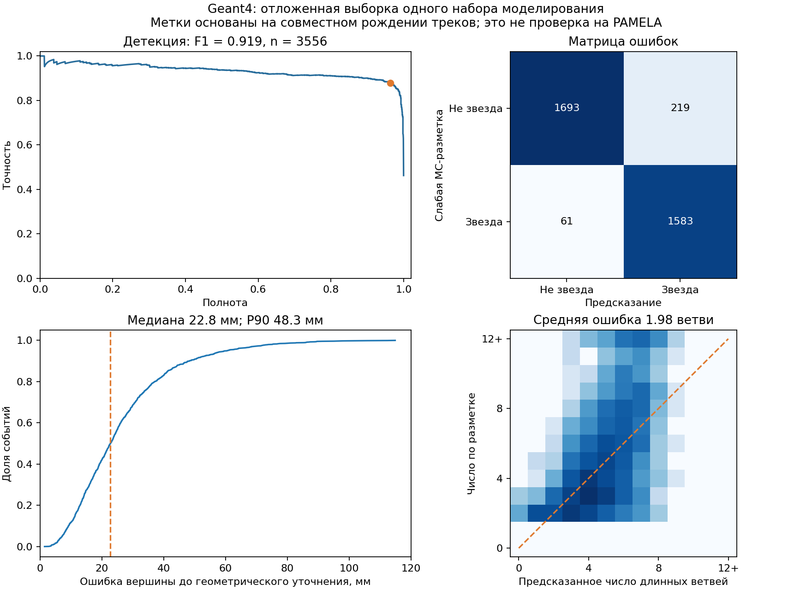

# Звёзды: новый эксперимент на Geant4

Собран и выполнен прототип: две проекции → обнаружение кандидата → вершина
и число ветвей → несколько 3D-сопоставлений → энергии на треках → отдельная
гипотеза достраивания. **Детекция даёт полезный результат; точное 3D-восстановление
пока остаётся нерешённой частью.** Числа старого диплома здесь не используются.

Демонстрация — `star_reconstruction.ipynb`. Разбор исходных ноутбуков,
переписки и диплома — `NOTEBOOK_INVENTORY.md` и `RECONSTRUCTION_AUDIT.md`.

## Разметка

| Категория | Событий |
|---|---:|
| Не менее двух длинных заряженных треков, родившихся у вершины | 8 617 |
| Другие взаимодействия | 2 093 |
| Завершение `Transportation`, без таких исходящих ветвей | 9 101 |
| Неоднозначные / неподдержанные случаи | 189 |

Вершина — последняя координата `TrackID=1`, согласованная с `Z_end`
в пределах 0,01 мм. Учитываются `Inelastic` и `CaptureAtRest` внутри
детектора. Кандидат на ветвь рождается не дальше 0,01 мм от вершины;
максимальное удаление от точки рождения внутри детектора — не меньше
8,09 мм. Заряд определяется по PDG. Короткие отдачи и электроны, родившиеся
раньше на первичном треке, не увеличивают число длинных ветвей.

Это **слабая геометрическая разметка** `coborn-v1`: без `ParentID` совместное
рождение не доказывает прямое родство. Длинный трек не обязательно различим
в обеих проекциях. Число по разметке нельзя называть проверенным числом
наблюдаемых лучей. Метки, кандидаты и причины исключения сохранены
в `data/derived/labels.jsonl`; SHA-256 и состав — `results/dataset_manifest.json`.

## Разбиение и отсутствие подсматривания

Хеш двух измеренных проекций определяет train/validation/test примерно
60/20/20; идентичные пары остаются в одной части. Уже изученные события
0–499 обоих типов и события первоначальной пробы принудительно отнесены
к train. Итоговое разбиение: **12 555 / 3 749 / 3 696** событий.

Вход — 440 признаков двух матриц: энергии, число активных стрипов и
кластеров при фиксированных порогах, центроиды и ширины. PDG, `E_0`,
процесс, `Z_end` и ненаблюдаемая координата не являются входами.
Истина используется как обучающая цель и после реконструкции для оценки.

Сложность ExtraTrees и порог выбирались по F1 validation, вариант регрессии
вершины — по средней 3D-ошибке validation. На 48 событиях validation
сравнивались одна/три вершины и сглаживание 0,03/0,3; сохранено 0,3,
поскольку различие было мало. Затем зафиксированы контрольные суммы
кода, модели, меток и признаков: `results/frozen_protocol.json`.
Команды test проверяют эти суммы. Проверяются новые события тех же двух
наборов моделирования; перенос на другие настройки и PAMELA не проверен.

## Детекция на отложенных событиях

Из 3 696 тестовых событий оценены 3 556: исключены 110 с отсутствующей
проекцией и 30 с неопределённой меткой. Среди оценённых — 1 644 звезды.

| Метрика | Результат |
|---|---:|
| Precision: доля звёзд среди срабатываний | 0,878 |
| Recall: доля найденных звёзд | 0,963 |
| F1 | **0,919** |
| 95% интервал F1, bootstrap событий | 0,910–0,928 |
| F1 простого порога числа активных стрипов | 0,878 |
| Ложные срабатывания среди `Transportation` | 0,52% |
| Ложные срабатывания среди других взаимодействий | **55,82%** |
| F1 для начальной энергии 80–1000 МэВ | 0,695 |

Матрица ошибок: TN=1693, FP=219, FN=61, TP=1583. Общий результат во многом
обеспечивается отделением взаимодействий от пролётов. Различение
многолучевой топологии и других взаимодействий существенно хуже.
Счёт ансамбля не калибровался как физическая вероятность.

До геометрического уточнения медиана ошибки вершины — 22,75 мм,
среднее — 26,39 мм. Средняя абсолютная ошибка числа длинных ветвей — 1,98.
Предсказания сохранены в `results/star_test_predictions.jsonl`, метрики
по частицам и энергиям — в `results/star_test.json`.

## Реконструкция на 44 плоскостях

X считывается на нечётных физических плоскостях, Y — на чётных. Соседние
плоскости не принуждаются иметь равные энергии. По обучающим траекториям
восстановлены период 8,09 мм, чувствительная толщина 0,38 мм, шаг стрипа
2,44 мм и промежутки между тремя сенсорами. На 9 998 координатах простых
первичных пересечений индекс стрипа совпал в 99,44% случаев. Это эмпирическая
проверка; исходная геометрия Geant4 всё ещё нужна.

Сравниваются вершина регрессора, энергетический пик и их середина.
В каждом виде выделяются конечные прямые, включая обратные; X/Y-ветви
переставляются отдельно по направлению. Ограничение v1 — четыре ветви.
Несопоставленные лучи и срабатывание ограничения записываются.

Энергии неотрицательны, задаются на пересечениях лучей с плоскостями.
Сопоставление использует явное предположение о плавном изменении энергии
вдоль луча. Независимые произвольные энергии на чередующихся плоскостях
сами по себе неоднозначность не разрешают. Сохраняются все рассмотренные
сопоставления и различия целевых функций.

Отдельное достраивание интерполирует **ненаблюдаемую** проекцию на нужную
глубину и решает транспортную задачу с предпочтением близости к трекам
и непрерывности. Реальная измеренная энергия сохраняется. Интерполяция —
предположение; малая проекционная ошибка не подтверждает правильность 3D.

Проверены 600 тестовых событий: по 100 каждого из трёх типов для протонов
и антипротонов. Набор намеренно сбалансирован и не оценивает частоту
срабатываний. Из 200 звёзд найдены 195.

| Метрика на 200 звёздах | Результат |
|---|---:|
| Средний 3D IoU прямой маски, пропуски = 0 | 0,048 |
| Средний 3D IoU достраивания, пропуски = 0 | **0,127** |
| Относительная L1-ошибка энергии, среднее на 195 реконструкциях | **1,605** |
| Медиана уточнённой ошибки вершины, 195 событий | 19,62 мм |
| Срабатываний ограничения четырёх ветвей | 114 |
| Несколько почти равноценных сопоставлений | 118 из 195 |

IoU сравнивает ячейки на **одинаковых 44 плоскостях**, порог для эталона
и достраивания — 0,01 МэВ. У прямой маски сравнивается весь геометрический
носитель. Это другая метрика, чем условное объединение слоёв в первой пробе.
На тех же 195 событиях уточнение снижает медиану ошибки вершины с 23,16
до 19,62 мм, но **повышает среднюю** с 26,20 до 32,01 мм из-за крупных
промахов. На 16 validation-звёздах улучшение было заметно сильнее:
маленькая проба оказалась слишком оптимистичной.

Полные результаты: `results/reconstruction44_test_search_0.3.json`.
Все энергетические оптимизации завершились успешно; сходимость решателя
не означает физической правильности решения.

## Следующие исследовательские шаги

1. Согласовать определение **наблюдаемой** звезды: пересечения плоскостей,
   пороги и разделимость ветвей. Получить `ParentID` и точную геометрию;
   проверить слабые метки вручную. При изменении разметки начать новую
   версию эксперимента: текущий test уже просмотрен.
2. Сосредоточить детектор на трудном различии многолучевых и остальных
   взаимодействий и низких энергиях; калибровать счёт и отказ от решения.
3. Заменить фиксированный пучок прямых на ветви с конечной длиной,
   изломами и разделением слившихся проекций. Исправлять крупные промахи
   вершины, а не ориентироваться только на медиану.
4. Оценивать набор допустимых 3D-топологий, направления и ложные соединения.
   118 неоднозначных случаев показывают, почему одной красивой картинки мало.
5. Оставить интерполяционное достраивание как сравнительный метод:
   при IoU=0,127 и L1=1,605 его нельзя представлять как решение восстановления
   энергии. Нужна более обоснованная модель переноса между плоскостями.

Главная недостающая часть исходной работы — проверяемое определение звёзд,
устойчивое выделение их топологии и учёт неоднозначности. Теперь эти
недостатки можно измерять, а изменения — сравнивать воспроизводимо.
